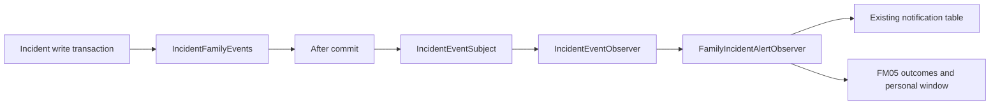

# FM05 incident event / family observer integration

Implemented: the event contract, Observer subject and interface, after-commit bridge, family observer, safe IN_APP message creation, persistent deduplication/outcomes, and personal response windows. Shared `EscalationService` routing now registers raised and chain-exhausted facts in the source write transaction. Its old direct family sender has been replaced in the same integration; manager/caregiver broadcasts and responder handovers remain. Inbox operations now recheck current authorization, filter unresolved resources and use Singapore business time. Family INCIDENT bell links now open the authorized detail and record notification read/view independently after rendering. Real CG04 HTTP source tests establish producer activation, and the full HTTP/database/browser workflow is now covered below.

## Production source integration

Inject `sg.nus.carelink.incident.application.IncidentFamilyEvents`. Inside the **write transaction** that saves/routes the incident, publish the corresponding fact:

```java
// New incident, after its persisted ID and final routed elder are known:
events.raised(eventId, incidentId, elderId, occurredAt);

// Escalation chain exhausted, after UNRESOLVED_ESCALATED is persisted:
events.unresolved(eventId, incidentId, elderId, occurredAt);
```

`EscalationService.routeNewIncident` generates a UUID once for the raised fact, using the persisted reportedAt in the Singapore business zone. The chain-exhausted branch generates a different UUID and its own occurrence time after persisting UNRESOLVED_ESCALATED. An incident with no available responder can create both facts in one transaction; these are two event types, not duplicate deliveries. Successful CG04 command replay returns its existing receipt before routing, so it generates neither another event nor another message. Explicit event replay must reuse the original eventId and occurredAt. No caller identity, family ID, notification text or clinical description is accepted. The bridge normalizes offsets and microsecond precision; reusing an ID with different facts is rejected by the consumer. Calls outside a write transaction fail immediately. Ordinary manager handovers are not family broadcast events.

The publisher registers a callback and dispatches only after successful commit. The subject targets `IncidentEventObserver`, not a particular notifier. Runtime failure in one observer does not block another or turn the already committed source into a failed save. The family consumer uses independent transactions; each recipient rechecks current binding, enabled account and FAMILY role before a new delivery. FULL and READ_ONLY qualify. Optional subscriptions do not disable urgent alerts.



The production handoff is implemented: `IncidentAlert`/`NotificationTableAlert` now handle staff broadcast and handover only. The old bound-family broadcast and chain-exhausted sender are removed; existing family message rows are untouched. BROADCAST timeline counts describe synchronous staff recipients, and CHAIN_EXHAUSTED records event registration without claiming successful family delivery. Routing, claim/resolve rules and CG04 version/command/receipt logic are unchanged. Existing sources sharing this route (including elder SOS and system-raised service incidents) naturally use the same publication point; this is not implementation of additional source endpoints. The inbox authorization and bell navigation integrations below preserve this publication contract.

## Persistence and failure semantics

Flyway `V15__family_alert_delivery.sql` adds three FM05 tables without modifying existing tables or historical rows:

V15 is the merged FM05 migration; V16/V17 belong to caregiver receipts and execution basics. Source activation needs no migration or historical data rewrite. All 17 existing migrations must remain valid on a fresh integration database.

| Table | Meaning |
| --- | --- |
| `family_alert_event` | Stable event facts and the last processing outcome: PROCESSED, NO_RECIPIENTS or FAILED |
| `family_alert_delivery` | One IN_APP result per event/family, including skipped or failed recipients and safe reason codes |
| `family_alert_window` | First successfully created message and immutable openedAt/acknowledgeBy per incident/family |

Recipient delivery serializes on the event/family unique key using a locking current read. The message, successful delivery row and first window commit together. A failure rolls them back; a separate transaction records FAILED, while other recipients continue. Successful recipients are never recreated on replay; failed or skipped recipients can be re-evaluated when the producer explicitly replays the same event. The outcome tables store IDs, times and fixed reason codes, not descriptions or acknowledgement notes. If outcome storage itself is unavailable, the remaining evidence is a safe log with event ID, family ID and exception type; it cannot be reported as a durable failure record.

Messages use the existing uppercase `INCIDENT`, `IN_APP` and `PENDING` values. The existing inbox transitions them to SENT; SENT means available in the inbox, not read or acknowledged. Titles/bodies use only severity/category or a generic chain-exhausted explanation, never raw description, location, internal logs or staff IDs. The severity/category are read from the persisted incident at consumption time.

The first successful creation opens the default two-hour personal window; `carelink.family-alert.response-window` can override the positive ISO duration (for example `PT45M`). The start is creation time, not event occurredAt, inbox polling time or manager respondBy. Another event, inbox delivery, replay or notification read does not reset it. `GET /api/family/incidents/{id}` returns this current family's deadline, or null if no FM05 window exists. Historical notifications are not backfilled into windows.

Creating a message/window never inserts or alters `incident_acknowledgement`. Existing viewedAt, acknowledgedAt and responseNote remain intact, including acknowledgement before message creation. Future reminder logic must additionally require an absent acknowledgedAt; the existence of a window does not put an already acknowledged family back into waiting. Reminders and family transfer are not implemented here.

This is an in-process after-commit design, without an outbox or a persistent event dispatcher. Outcome/deduplication persistence does not guarantee recovery from a process crash between source commit and callback processing. A failed consumer can be explicitly replayed using its original recorded facts; successful CG04 HTTP command replay does not retry notification delivery. There is no automatic durable recovery guarantee.


## Inbox authorization integration

The four self-inbox operations (list, unread-count, read, read-all) resolve the current account before delivery or any other mutation. Disabled/deleted accounts and accounts without a current system role return 403. A session containing FAMILY must still have FAMILY in the database, even if a MANAGER role remains. Current FAMILY accounts always use the family binding rule, including multi-role accounts and sessions created before FAMILY was added. The service applies the status restriction and access audit to this resolved reader, not only the cached session flag.

For family readers, `INCIDENT`, `ROSTER_CHANGE` and `SPOT_CHECK` messages require a resolvable elder and a currently ACTIVE, unexpired binding. Only rows with both resource_type and resource_id null are recognized as account-only messages. Unknown types, partial resource references and orphaned care records are excluded before pagination/counting and cannot be delivered or marked read/read-all. A previously delivered but now inaccessible row keeps its historical status; it is not deleted or backfilled. Non-family readers retain their own staff/account resource behavior, including CREDENTIAL and ABSENCE rows.

`NotificationService` converts the clock instant into Asia/Singapore business time for expiry comparisons, delivery and first-read timestamps. JDBC continues to bind/read Timestamp, matching existing JPA and notifier mappings. Changing the injected Clock zone does not shift the business timestamp. Concurrent/repeated read still preserves the first readAt; none of these operations creates an incident view, acknowledgement or personal response window.

`FamilyIncidentInboxIT` uses real login sessions, CSRF and MySQL with a +05:00 server/Asia-Singapore connection. It covers the resolved issues below alongside ownership, authorized pagination/order/status, READ_ONLY bindings, revoked/rejected/pending/deleted/expired bindings, absent incidents, empty inbox, concurrent first-read, and unaffected manager/caregiver/elder recipients. The old known-inbox-gap characterization assertions have been replaced by rejection/exclusion acceptance assertions; no such tags remain in this suite.

| Reference | Resolved behavior | Acceptance coverage |
| --- | --- | --- |
| INBOX-01 | Current enablement and role checks precede all four self-inbox operations; stale sessions do not regain access through another role. | Disable/delete account, remove FAMILY with/without MANAGER retained, remove staff role; all four operations reject without modifying notifications/windows. Current FAMILY added after staff login still filters care content. |
| INBOX-02 | Unknown/unresolved care resources cannot become account-only messages by default. | Mixed visible, unknown, partial and orphan rows: authorized page/count/read/read-all only; excluded PENDING rows stay PENDING; null/null account messages remain usable. |
| INBOX-03 | Expiry and delivery/read timestamps use Singapore regardless of Clock zone. | UTC and Asia/Singapore clocks at the exact expiry boundary exclude the expired elder and show identical Singapore delivery/first-read times for a still-authorized elder. |

The shared Page/Size schemas specify nonnegative page and size 1–200. The existing service normalizes page=-1 to 0, size=0 to 1 and size=201 to 200. Compatibility tests record this existing clamping policy; no frontend should rely on sending invalid values. Changing that policy is the notification owner's decision, not an FM05 implementation change.

Source activation and the old family generator handoff are complete. `FamilyIncidentSourceIT` exercises real login/CSRF and POST `/api/incidents`, safe family messages/windows alongside staff routing, successful and concurrent command replay, initially empty chains, real overdue escalation, revoked recipients, and consumer storage failure after source commit. A spy only injects a failure/checkpoint at CG04 receipt storage after routing: source rollback leaves no incident/log/staff or family notification/event/window. No test publishes an event to substitute for the source. INBOX-01/02/03 are resolved by the self-inbox acceptance tests above. Bell navigation is implemented below; real-source browser acceptance is recorded below. Source/inbox tests and synthetic frontend fixtures do not claim that acceptance is complete.


## Family detail frontend

The family-owned route `/family/incidents/:id` reads only `GET /api/family/incidents/{id}` after checking the current FAMILY session. It renders the authorized projection and the current recipient's receipts, with Singapore timestamps and plain text. There is no internal handling timeline in this projection, so the page does not request or invent one.

A viewing command runs only after the successful detail is rendered; explicit awareness requires the `I am aware` action. Both commands recheck the session and initialize CSRF. Awareness accepts only the optional responseNote (up to the backend's 255 string-length limit); IDs, roles, status and times are not request fields. Failures do not show success, and acknowledgement failures retain the note for explicit retry. Personal deadline expiry, a missing window or a resolved incident do not disable legitimate awareness.

The request lifecycle cancels obsolete reads/commands and clears content on access failures or account changes. Concurrent view/ack responses preserve the already known first awareness receipt. Cancellation does not undo a command already committed on the server; reloading reads the authoritative receipt. Direct URLs make no notification read request. A valid bell navigation context adds a separate notification read command; it never grants detail access or creates awareness.

When offline or hidden, the detail page cancels pending requests and hides care content. Once visible and online, it rechecks the session and reads the current personal window and receipts; repeated activity events do not duplicate that reload. An unsent note stays only in the mounted page's memory for the same account and is cleared on an account change or denied access. An interrupted acknowledgement is never automatically resent: the authoritative read either shows the saved first receipt or reports that saving could not be confirmed and allows explicit retry. Terminal access failures stop automatic recovery; a 403 can be retried explicitly after access is restored. Leaving removes the activity listeners. This adds no polling timer or browser persistence.

The shared bell routes FAMILY notifications with resourceType=INCIDENT to `/family/incidents/{resourceId}`, carrying the positive safe-integer notification/incident pair in React Router state. URL query parameters, localStorage/sessionStorage and caller-supplied family/elder IDs are not used for this context. A malformed or mismatched context is ignored by the detail; invalid bell links neither navigate nor submit a read. Existing manager/caregiver and other-resource destinations remain unchanged.

After the authorized detail renders, notification read and incident view run independently. Each command rechecks the same FAMILY session and initializes CSRF. The notification receipt must confirm the matching notification, INCIDENT resource and READ status before the page reports success and refreshes the bell count/list. A transient read failure keeps unread state and offers explicit retry, without preventing legitimate awareness or inventing a viewing success. Notification access denial clears care content; a missing notification is treated as unavailable access until explicitly reauthorized. Navigating away, changing routes or becoming hidden/offline cancels pending work and ignores late receipts. Read/view are idempotent facts; acknowledgement is never automatically retried or created.

For other bell messages and explicit mark-all-read, local READ state/count change only after confirmed server success. Pending writes disable duplicate actions and use cancellation signals; failure retains visible unread items and offers retry. Polling/backoff, list cancellation and layout remain in place. Manual mark-all-read records notification read only, never incident view or awareness.

Frontend tests exercise the actual bell, route, feature API, CSRF and request lifecycle with synthetic responses: authorized render ordering, direct/malformed context, independent failed read/view, explicit awareness, denial, late cancellation, hidden/offline recovery and unchanged staff routing. Browser verification uses the actual Vite app with a synthetic local API for successful navigation, failed read/retry and denied detail. These fixtures verify frontend integration, not real CG04-to-bell acceptance. The subsequent real-source acceptance below closes that boundary.


## Real-source workflow acceptance

`FamilyIncidentWorkflowIT` starts the actual application on a random HTTP port against a fresh MySQL database. It seeds fictional accounts/profiles/bindings only, then uses manager primary-caregiver assignment, care-plan creation/publication and roster reads to obtain the real assigned Visit. Every incident is created through caregiver `POST /api/incidents`; no fixture inserts the positive Visit/incident/notification/window/receipt or calls an event publisher. A controlled Singapore Clock makes deadline and first-time checks deterministic while the JVM runs in UTC and MySQL in +05:00 with a Singapore connection.

Its 13 scenarios cover the following public workflow and durable transaction boundaries:

- Two FULL/READ_ONLY family recipients receive separate safe inbox messages, personal windows and receipt identities. Notification read, incident view and explicit awareness remain separate; repeated commands preserve first timestamps/notes, another recipient's state, manager routing/deadline and the Visit's EXCEPTION state.
- Concurrent CG04 command replay creates one incident fact and one message per family. Concurrent family view/awareness and two awareness requests preserve the first saved awareness without changing another family or implicitly reading its message.
- After the personal window expires, an authorized family can still acknowledge an OPEN or manager-RESOLVED incident without implicitly reading/viewing or changing the manager result. Internal handling notes remain outside the family projection.
- Revocation through the elder's actual binding API, or expiry at the exact boundary, takes effect after an inbox/detail fetch in the same session. Detail/view/awareness/read deny access, list/count/read-all exclude the resource, and historical notification/window rows remain intact. The other authorized family retains access.
- A database-boundary failure saving the CG04 command receipt rolls back the incident, source state transition, registered facts and staff/family notification effects. A failure creating one family's message keeps the committed caregiver report successful, records the failed delivery and still delivers to the other family. Successful caregiver command replay does not automatically retry that failed notification.
- Notification-read or awareness persistence failure leaves previously saved view/deadline facts intact and reports failure. An explicit retry after storage recovers saves success once; later commands preserve that first success.
- Real manager chain exhaustion adds a distinct unresolved event/message without resetting first read, awareness or personal window. A rejected repeat escalation creates no additional message.

SQL mutations beyond identity/binding setup are narrowly scoped failure triggers and expiry fixtures. Failure triggers are removed in finally; expiry applies only to the newly created binding in the class-owned database. Database reads assert the agreed durable outcomes and rollback boundary, while normal user behavior is exercised over real login sessions, CSRF and HTTP endpoints. No internal collaborator is mocked in this workflow suite.

### Browser acceptance (2026-10-08)

The actual packaged backend, current Vite frontend and a new local-only MySQL container were used together. SQL created synthetic identities and bindings; real manager HTTP assignment/publication created the plan/Visit, and real caregiver HTTP check-in started it. The caregiver then used the actual CG04 form to submit a fictional HIGH/FALL report. The after-commit event was PROCESSED, with one message/window for each family, staff messages retained and no family receipt before viewing.

Family A signed in, opened the actual bell message, saw the authorized description/personal deadline, and received independent READ/view receipts. Only its `I am aware` click created awareness; refreshing preserved the first values, the incident stayed OPEN and the Visit stayed EXCEPTION. Family B's READ_ONLY binding received its own unread message and displayed no A note/awareness. After real manager claim/resolve, B could explicitly acknowledge the resolved incident. Elder binding revocation followed by page refresh removed B's care content.

A second real CG04 report plus a scoped database read-failure trigger established the negative browser path: the read endpoint returned 500, notification stayed SENT with null readAt, view was saved and awareness remained null. Removing that trigger and clicking `Retry notification read` returned READ and cleared the count without creating awareness. Original windows/receipts remained unchanged.

Screenshots and request/database evidence are retained outside the repository in the personal batch plan. The temporary browser and app processes are stopped; the separately named preview database container is stopped with its synthetic data retained. This acceptance establishes the in-app CG04 source-to-family workflow only. Email/SMS/Push, reminders, durable crash recovery, automatic family transfer, extra incident sources and internal manager timelines are outside that integration delivery. Follow-on source acceptance is recorded separately below. Final synchronization and delivery checks are recorded below.


## Final delivery validation (2026-10-08)

The integration branch includes the fetched main baseline `df2a485`; synchronization required no additional merge. Final UTC `clean verify -Pintegration` passed 1,252 unit tests and 730 MySQL integration scenarios with zero failures/errors/skips, including ArchUnit and the domain coverage gate. Backend JaCoCo line coverage is 98.08% and branch coverage 86.15%. Final frontend coverage passed 75 files / 911 tests, with line coverage 91.85% and branch coverage 85.14%; build and lint passed with the three existing lint warnings and existing bundle-size warning. No production change was needed after real-source acceptance.

The actual FM05/notification contract subset (seven paths and their 20 referenced components), all 302 internal references, and the full draft specification validate. All 17 migration versions are unique and unchanged from main; real MySQL tests apply them successfully. Full validation of `openapi.yaml` separately identifies eight existing unquoted, comma-containing descriptions from caregiver and MG04 contributions. They are identical on main and are left for their owners: no API behavior is changed or full-spec validation success claimed. These documentation defects do not prevent the tested FM05 workflow.

GitHub checks for implementation revision `191b99a` passed the backend, frontend, secret scanning, SonarCloud analysis, Quality gate and CG-01 full MySQL regression. Main-only dependency/deployment jobs are skipped on this PR and are not claimed as verified. PR #69 remains unmerged; merging requires the user's instruction. The completed in-app flow retains the scope limitations above.


## EL03 source acceptance (FM05 batch 8.1)

EL03 already calls `IncidentService.createElderEmergency` → `EscalationService.routeNewIncident` in its source write transaction. No second publisher, observer or family sender is needed. `FamilyElderSosWorkflowIT` creates every positive SOS through the actual session/CSRF-protected `POST /api/elders/me/emergency-calls`, using only fictional identity/profile/binding setup in SQL. The existing EL03 and manager production code are unchanged.

Eight real HTTP/MySQL scenarios cover two independent FULL/READ_ONLY recipients, `ELDER_SOS` / `SOS` / `HIGH` without a Visit, the family-safe description projection (excluding GPS/location/staff data), two-hour windows, independent first read/view/awareness and repeat commands, source rollback after event registration, failure of one recipient's notification without undoing SOS or blocking another family, actual elder binding revocation before/after SOS, an initially empty responder chain, two distinct SOS submissions, and rejected authentication/role/profile/validation/CSRF requests. Negative SQL mutations are scoped persistence-failure triggers removed in finally; no test directly publishes an event.

With no responder, raised and unresolved are two distinct facts/messages; each family still has one first window. EL03 has no persisted clientRequestId command receipt: another POST is a new SOS, not a replay of the earlier call. Event-consumer deduplication must not merge these different incidents, and another SOS does not retry a previously failed delivery. Existing explicit replay/crash-recovery limits remain.

The SOS source uses real Singapore system time, so this suite does not pretend an injected fixed Clock controls its reportedAt. It runs with a UTC JVM, +05:00 MySQL server and Singapore JDBC connection. Existing incident DATETIME rounds reportedAt to seconds; the test permits that storage precision. Personal windows retain microsecond precision in the FM05 tables.

Real-clock acceptance exposed a separate FM05 receipt precision defect: the first view/awareness response contained fractional seconds while receipt DATETIME persisted seconds, making reload/repeated responses differ. `FamilyIncidentReceiptService` now normalizes new receipt timestamps to seconds before saving/returning; first-value, note, authorization and audit semantics remain. A deterministic fractional-Clock regression in `FamilyIncidentReceiptIT` verifies the first response, authorized detail reload and repeated commands return identical receipts.

Family clients continue to use `GET /api/family/incidents/{id}`. This acceptance does not claim the legacy EL03 `GET /api/emergency-calls/{id}` raw Incident projection is family-safe. The main baseline for this batch does not yet contain SYS03 assigned-caregiver missed check-in scanning; other system-raised incidents sharing the source enum do not count as SYS03 acceptance. The fetched `codex/sys03-missed-check-in` branch now has a source service calling the shared route, but it is not merged into this batch and has not been jointly accepted here. SYS03 source changes belong to its owner; the existing publication point and Observer apply without a separate listener or direct family notification.


### EL03 browser and delivery validation (2026-10-08)

The actual elder SOS button, Vite frontend, packaged backend and a separately named local-only MySQL database completed the source-to-family workflow with fictional accounts/bindings only. The button created an OPEN/HIGH SOS without a Visit or description, and its raised fact was PROCESSED with separate messages/windows and no initial family receipt. Family A used the bell to open the safe detail, received separate read/view receipts, explicitly confirmed awareness and refreshed without replacing the first values. Family B still had its own unread message and unconfirmed receipt; after opening it, the READ_ONLY family could view its own awareness action without seeing A's note. Revoking B through the real elder binding API and refreshing hid the care detail and displayed access unavailable. Source status/responder and both first windows remained intact. Screenshots and database observations are kept outside the repository; only the synthetic preview processes/container were stopped.

Final local UTC `clean verify -Pintegration` passed 1,252 unit/architecture tests and 739 MySQL integration scenarios, with zero failures/errors/skips and the domain coverage gate passing. Backend line coverage is 98.08%, branch coverage 86.19%. The three relevant frontend suites (elder Emergency, family Incident page and NotificationBell) passed all 88 tests; no frontend source was changed. This batch adds eight SOS workflow scenarios and one deterministic receipt precision regression. It does not implement SYS03, EMAIL or reminder/transfer delivery, and leaves the existing unrelated OpenAPI formatting errors unchanged.
